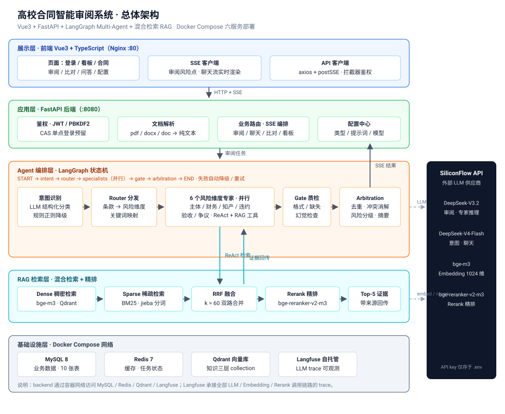

# 高校合同智能审阅系统（Contract Review Agent）

[](https://github.com/wangn-tech/contract-review/actions/workflows/ci.yml)

基于 **LangGraph Multi-Agent + 混合检索 RAG** 的高校合同智能审阅系统。面向高校采购场景（以深圳大学采购管理制度为知识底座）：上传合同 → Agent 并行审阅 6 个风险维度 → SSE 实时推送风险点与证据 → 支持合同比对 / 合同问答 / 看板统计。配套 Docker Compose 一键部署、GitHub Actions CI、Langfuse 可观测与 Locust 压测。

## 架构

<p align="center">
  
</p>

- **Agent 编排（LangGraph）**：意图识别（LLM + 规则降级）→ 条款分发 → 6 个风险维度专家并行审阅（ReAct + RAG 工具）→ Gate 质检 → 仲裁汇总；提示词模板独立管理。
- **RAG 工程**：bge-m3 稠密（Qdrant）+ BM25 稀疏双路召回 → RRF 融合 → bge-reranker-v2-m3 精排；知识分层（制度 / 法规 / 模板），证据可追溯；内置检索指标与 RAGAS 测评。
- **后端工程**：FastAPI + SQLAlchemy 2 + Pydantic v2 + JWT + SSE 流式；统一响应与异常；PBKDF2 密码；CI（ruff + pytest + 前端构建 + 镜像）。
- **可观测与压测**：Langfuse 自托管 trace 关联；Locust 全链路压测（SSE TTFT / 完整时长 / 成功率）。

> 架构图采用"展示 / 应用 / Agent 编排 / RAG 检索 / 基础设施"五层分层；详细版流程图与数据库 E-R 图见 [`docs/DESIGN.md`](docs/DESIGN.md)。

## 核心功能

| 模块 | 能力 |
|---|---|
| 合同审阅 | 6 风险维度并行审阅（主体合规 / 财务付款 / 知识产权 / 违约责任 / 验收质保 / 争议管辖），SSE 实时推送，证据引用制度条款 |
| 合同比对 | 上传两份合同逐条比对差异 |
| 合同问答 | 基于合同文本与知识库的流式问答 |
| 看板统计 | 风险分布、维度命中率、审阅耗时趋势（ECharts） |
| 知识库 | 深大采购制度 + 法规 + 合同模板三层语料，自动 ingest |
| 管理配置 | 合同类型 / 专家提示词 / 模型参数在线配置 |
| 依赖策略 | 仅用官方独立包：langgraph / langchain-core / langchain-openai + 原生 openai SDK；**主环境不含 langchain-community** |
| RAGAS 评估 | `uv sync --extra eval`（ragas 0.2.x + langchain-community<0.4）；ragas 需要 community 的 vertexai 模块，community 0.4 已移除，故 eval 环境锁 <0.4 |


## 技术栈

| 层 | 技术 |
|---|---|
| Agent 编排 | LangGraph（状态机 · 条件路由 · 节点并行）、LangChain Core/OpenAI、提示词模板独立 .md |
| RAG | Qdrant + BAAI/bge-m3（稠密）、BM25 + jieba（稀疏）、RRF 融合、bge-reranker-v2-m3 精排 |
| LLM | OpenAI SDK 接入任意 OpenAI-compatible 供应商（默认 SiliconFlow）：DeepSeek-V3.2（审阅）、DeepSeek-V4-Flash（意图/聊天）、bge 系列（embedding/rerank） |
| 后端 | FastAPI · SQLAlchemy 2 · Pydantic v2 · JWT(PBKDF2) · SSE · Langfuse |
| 前端 | Vue3 + TypeScript + Vite + Element Plus + Pinia + ECharts |
| 工程化 | Docker Compose（六服务）· GitHub Actions（5 Job）· Locust · uv |

## 快速开始

```bash
make up       # Docker 一键启动（需先配置根目录 .env）
make ingest   # 构建知识库
make test     # 后端测试
make help     # 查看全部命令（含本地开发/测评/压测）
```

```bash
# 1. 配置密钥（SiliconFlow key 必填；.env 统一放项目根目录）
cp backend/.env.example .env
vim .env                        # SILICONFLOW_API_KEY=sk-xxx
# 更换模型供应商：只需设置 LLM_BASE_URL 与 LLM_API_KEY（OpenAI SDK 接入，
# 兼容任何 OpenAI-compatible 服务，如 SiliconFlow/OpenAI/DeepSeek 官方等）；
# 未设置时回退到 SILICONFLOW_API_KEY / SILICONFLOW_BASE_URL

# 2. 一键起全套（mysql/redis/qdrant/langfuse/backend/frontend）
docker compose -f deploy/docker-compose.yml up -d --build

# 3. 构建知识库（深大制度 + 法规 + 模板 → Qdrant + BM25）
docker compose -f deploy/docker-compose.yml exec backend python scripts/ingest_kb.py

# 4. 打开前端 http://localhost（注册账号后上传合同并审阅）
```

> 完整启动 / 测试 / 压测 / 故障排查见 [`docs/QUICKSTART.md`](docs/QUICKSTART.md)。

## 文档导航

| 文档 | 内容 |
|---|---|
| [`docs/DESIGN.md`](docs/DESIGN.md) | 详细设计：总体架构、Agent 状态机、RAG 检索链路、数据库设计与 E-R 图、Docker 编排、CI 流水线 |
| [`docs/QUICKSTART.md`](docs/QUICKSTART.md) | 启动与测试指南：Docker 一键 / 本地开发 / 测试矩阵 / 压测 / 常见问题 |
| [`docs/benchmark.md`](docs/benchmark.md) | 性能压测报告（Locust：TTFT / 完整时长 / 成功率，待环境跑完回填） |
| [`docs/rag-eval.md`](docs/rag-eval.md) | RAG 测评报告（Recall@K / MRR / NDCG / RAGAS，golden set 58 条） |

## 本地开发

```bash
# 后端（Python 3.12 + uv；.env 回退读取项目根目录）
cd backend && uv sync
uv run uvicorn app.main:app --reload --port 8080   # http://localhost:8080/docs

# 前端（Node 22）
cd frontend && npm install
npm run dev                                        # http://localhost:5173，/api 代理到 8080
```

## 目录结构

```
backend/
  app/agent/       LangGraph 状态机、节点（意图/分发/专家/质检/仲裁）、提示词模板
  app/rag/         ingest（chunker/crawler/loader）、retrievers（hybrid/BM25）、rerank、eval
  app/api/         FastAPI 路由（auth/contracts/sessions/reviews/comparisons/chats/admin/dashboard）
  app/services/    审阅编排（SSE）、聊天（SSE）、文档解析
  scripts/         ingest_kb.py（知识库构建）、eval_rag.py（RAG 测评）、bench_locust.py（压测）
frontend/          Vue3 + TS + Vite + Element Plus + Pinia + ECharts
deploy/            docker-compose（六服务）
.github/workflows/ CI（lint → test → 前端构建 → 镜像 → 部署占位）
docs/              架构图、设计文档、压测/测评报告
```

## 测试与验证

| 层 | 命令 | 覆盖 |
| --- | --- | --- |
| 单测/集成 | `make test` | 鉴权/会话/合同/审阅 SSE/聊天 SSE/Agent 纯逻辑/RAG 纯函数 |
| Lint | `make lint` | ruff（E/F/I/W/UP/B/SIM） |
| 前端 | `make frontend-build` | vue-tsc 类型检查 + Vite 构建 |
| 端到端 | `make smoke` | 真实 LLM + Qdrant 验证 Agent+RAG 全链路 |
| RAG 测评 | `make eval-rag` | 检索指标 + RAGAS（golden set 58 条） |
| 压测 | `make bench` | Locust 全链路（SSE TTFT / 成功率） |

## 简历亮点（Agent 项目）

1. **Multi-Agent 编排**：LangGraph 状态机（意图识别 → 分发 → 6 专家并行 → 质检 → 仲裁），提示词模板化 + JSON Schema 约束 + 规则降级兜底，专家并行（信号量限流 20）。
2. **RAG 全链路**：混合检索（dense + sparse → RRF → cross-encoder 重排）、知识分层、证据可追溯、检索指标（Recall@K / MRR / NDCG）+ RAGAS 四指标测评。
3. **工程化**：FastAPI 分层、SSE 流式、统一异常、CI 五阶段、Docker Compose 六服务、Langfuse 可观测、Locust 压测指标。
