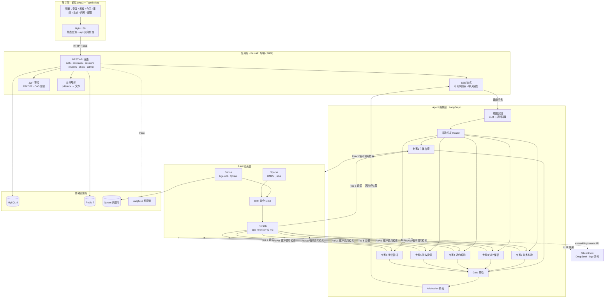

# 高校合同智能审阅系统（Contract Review Agent）

基于 **LangGraph Multi-Agent + 混合检索 RAG** 的高校合同智能审阅系统：上传合同 → Agent 并行审阅 6 个风险维度 → SSE 实时推送风险点 → 比对 / 问答 / 看板，配套 Docker Compose 一键部署、GitHub Actions CI、Langfuse 可观测与 Locust 压测。

## 架构



- **Agent 编排（LangGraph）**：意图识别（LLM + 规则降级）→ 条款分发 → 6 个风险维度专家并行审阅（ReAct + RAG 工具）→ Gate 质检 → 仲裁汇总；提示词模板独立管理。
- **RAG 工程**：bge-m3 稠密（Qdrant）+ BM25 稀疏双路召回 → RRF 融合 → bge-reranker-v2-m3 精排；知识分层（制度/法规/模板），证据可追溯；内置检索指标与 RAGAS 测评。
- **后端工程**：FastAPI + SQLAlchemy 2 + Pydantic v2 + JWT + SSE 流式；统一响应与异常；PBKDF2 密码；CI（ruff + pytest + 前端构建 + 镜像）。
- **可观测与压测**：Langfuse 自托管 trace 关联；Locust 全链路压测（SSE TTFT/完整时长/成功率）。

## 快速开始

> 完整启动/测试指南见 [`docs/QUICKSTART.md`](docs/QUICKSTART.md)。

```bash
# 1. 配置密钥（SiliconFlow key 必填）
cp backend/.env.example .env
# 编辑 .env: SILICONFLOW_API_KEY=sk-xxx

# 2. 一键起全套（mysql/redis/qdrant/langfuse/backend/frontend）
docker compose -f deploy/docker-compose.yml up -d --build

# 3. 构建知识库（深大制度 + 法规 + 模板 → Qdrant + BM25）
docker compose -f deploy/docker-compose.yml exec backend python scripts/ingest_kb.py

# 4. 打开前端 http://localhost（注册账号后上传合同并审阅）
```

## 本地开发

```bash
# 后端（Python 3.12 + uv）
cd backend && uv sync && uv run pytest tests/ -q && uv run ruff check app/ tests/
uv run uvicorn app.main:app --reload --port 8080

# 前端（Node 22）
cd frontend && npm install && npm run dev   # http://localhost:5173，/api 代理到 8080
```

## 目录结构

```
backend/
  app/agent/       LangGraph 状态机、节点（意图/分发/专家/质检/仲裁）、提示词模板
  app/rag/         ingest（chunker/crawler/loader）、retrievers（hybrid/BM25）、rerank、eval
  app/api/         FastAPI 路由（auth/contracts/sessions/reviews/comparisons/chats/admin/dashboard）
  app/services/    审阅编排（SSE）、聊天（SSE）、文档解析
  scripts/         ingest_kb.py（知识库构建）、eval_rag.py（RAG 测评）、bench_locust.py（压测）
frontend/          Vue3 + TS + Vite + Element Plus + Pinia + ECharts
deploy/            docker-compose（六服务）
.github/workflows/ CI（lint → test → 前端构建 → 镜像 → 部署占位）
docs/              设计文档、压测/测评报告模板
```

## 测试与验证

| 层 | 命令 | 覆盖 |
| --- | --- | --- |
| 单测/集成 | `uv run pytest tests/ -q` | 鉴权/会话/合同/审阅 SSE/聊天 SSE/Agent 纯逻辑/RAG 纯函数 |
| Lint | `uv run ruff check app/ tests/ scripts/` | E/F/I/W/UP/B/SIM |
| 前端 | `cd frontend && npm run build` | vue-tsc 类型检查 + Vite 构建 |
| 端到端 | docker compose 一键起 | 六服务健康检查 + 依赖等待 |

## 简历亮点（Agent 项目）

1. **Multi-Agent 编排**：LangGraph 状态机（意图识别 → 分发 → 6 专家并行 → 质检 → 仲裁），提示词模板化 + JSON Schema 约束 + 规则降级兜底，专家并行（信号量限流 20）。
2. **RAG 全链路**：混合检索（dense+sparse → RRF → cross-encoder 重排）、知识分层、证据可追溯、检索指标（Recall@K/MRR/NDCG）+ RAGAS 四指标测评。
3. **工程化**：FastAPI 分层、SSE 流式、统一异常、CI 五阶段、Docker Compose 六服务、Langfuse 可观测、Locust 压测指标。
