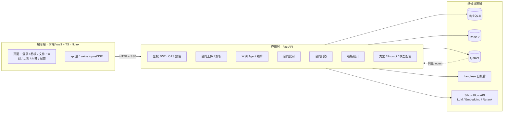
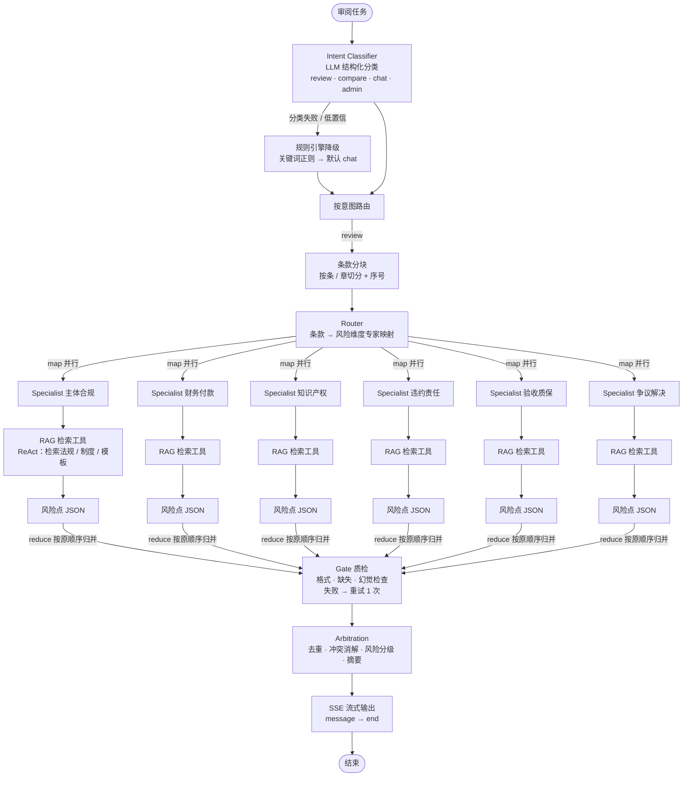
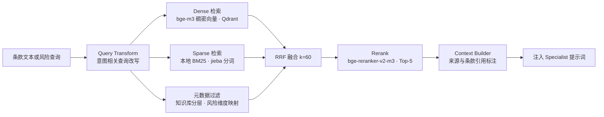
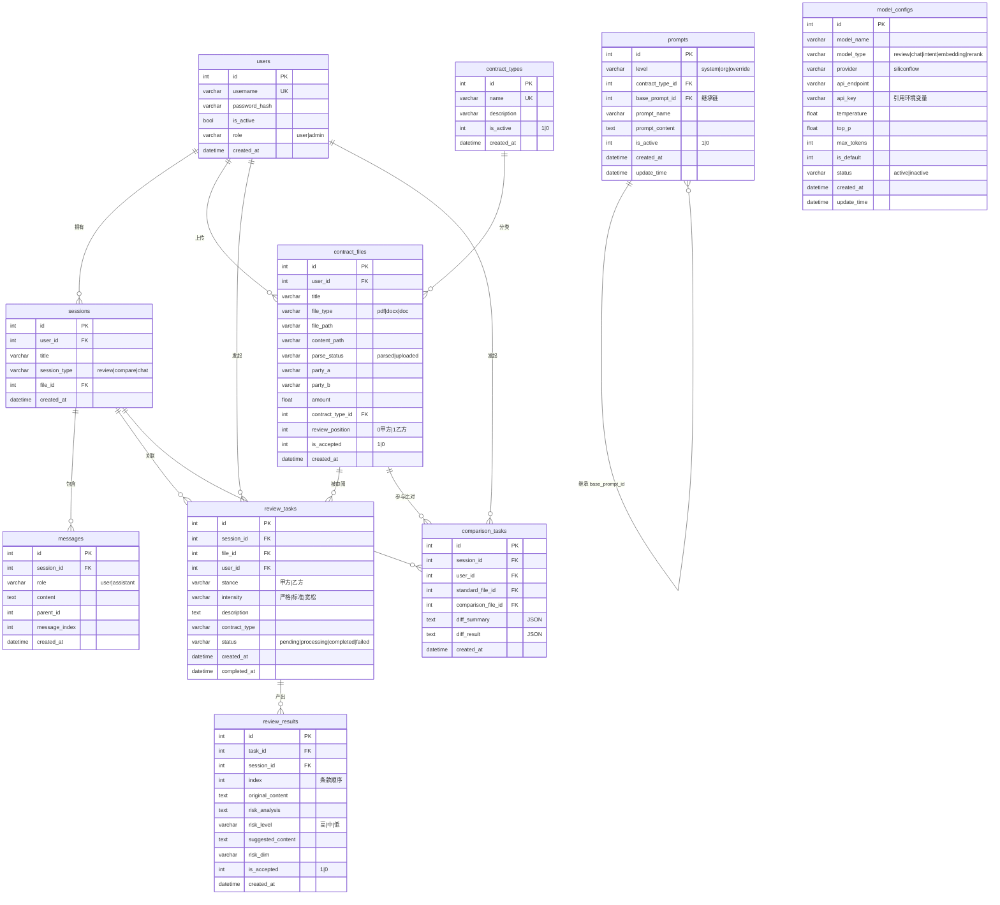
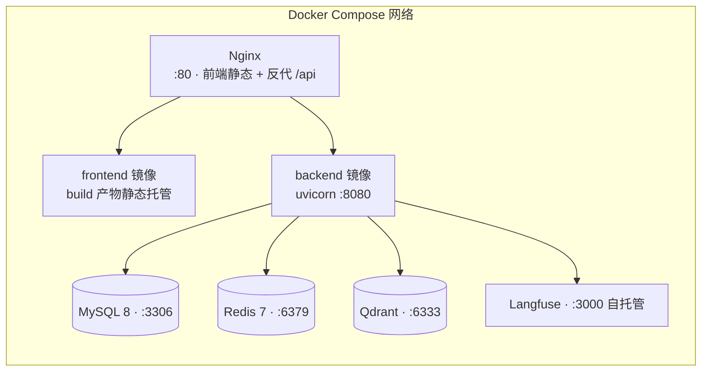
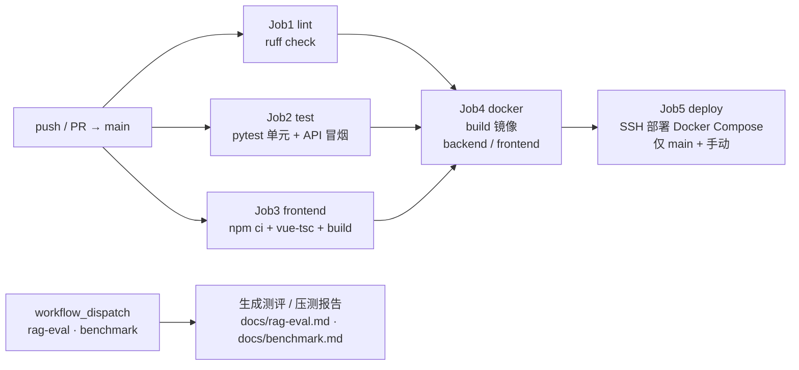

# 合同智能审阅系统 · 设计文档 v2

> 版本：v2.0　|　状态：已对齐，待实现　|　定位：高校合同审阅 Agent 系统（简历项目）
> 知识库场景：深圳大学采购合同管理制度 + 外部法规 + 样例合同模板

---

## 1. 项目定位与简历亮点

面向高校采购/合同管理场景的 **AI 合同审阅 Agent 系统**：上传合同 → 多智能体并行审阅（按风险维度）→ 流式输出风险点 → 人工接受/驳回 → 配套比对、问答、看板与配置管理。

**简历亮点矩阵**（实现时逐条落实）：

| 亮点 | 技术点 |
|---|---|
| 多智能体编排 | LangGraph 状态机：意图识别（LLM 主 + 规则降级兜底）→ Router 分发 → 6 个 Specialist 并行（map-reduce + 信号量限流）→ Gate 质检 → Arbitration 仲裁 |
| ReAct 工具调用 | Specialist 内 ReAct 循环：思考 → 检索法规/模板（RAG 工具）→ 生成风险点 |
| 混合检索 RAG | BGE-M3 一模型三表征（稠密+学习型稀疏+多向量）→ Qdrant 原生混合检索 → RRF 融合 → bge-reranker-v2-m3 精排 |
| 分层知识库 | 外部法规层 / 校内制度层（深大）/ 合同模板层，带元数据过滤 |
| RAG 可测评 | RAGAS（faithfulness/answer relevancy/context precision/context recall）+ 检索指标（Recall@K/MRR/NDCG@K），golden set 50 条 |
| 流式体验 | SSE 边审边出，前端打字机 |
| 可观测 | Langfuse 自托管，全链路追踪 + 实时指标 + llm-as-a-judge |
| 工程化 | Docker Compose 一键部署、GitHub Actions CI（lint+test+build+镜像）、Conventional Commits |
| 性能可证 | locust 压测：TTFT P50/P95、端到端时长、并发吞吐、成功率报告 |

---

## 2. 总体架构



---

## 3. 后端设计

### 3.1 技术栈

Python 3.12 · FastAPI · Pydantic v2 · SQLAlchemy 2 + PyMySQL · LangGraph + LangChain Core · openai SDK · sse-starlette · Qdrant 客户端 · 多引擎文档解析（pdfplumber/pymupdf/pypdf/docx/libreoffice/OCR/Docling/MinerU）· redis · mcp · langfuse SDK · ruff（lint/format）

### 3.2 目录结构

```
backend/
├── app/
│   ├── main.py                # FastAPI 入口：路由挂载、CORS、全局异常处理、Langfuse
│   ├── core/
│   │   ├── config.py          # pydantic-settings：环境变量驱动
│   │   ├── db.py              # SQLAlchemy engine/session
│   │   ├── redis.py           # Redis 客户端（令牌/缓存）
│   │   ├── security.py        # JWT 签发/校验/刷新、密码哈希
│   │   └── exceptions.py      # 统一异常 → GenericResponse
│   ├── api/                   # 路由层（薄）
│   │   ├── auth.py  users.py  sessions.py  contracts.py
│   │   ├── reviews.py  comparisons.py  chats.py
│   │   ├── admin_types.py  prompts.py  models.py  dashboard.py
│   ├── models/                # SQLAlchemy 模型
│   ├── schemas/               # Pydantic 请求/响应
│   ├── services/              # 业务服务
│   │   ├── document_parse.py  # 解析：pdf/docx/doc → 文本 + 结构化抽取
│   │   ├── review_service.py  # 审阅任务编排入口（调 agent graph）
│   │   ├── comparison_service.py
│   │   └── chat_service.py
│   ├── agent/                 # ★ Agent 编排
│   │   ├── graph.py           # LangGraph 状态机定义
│   │   ├── state.py           # 状态 TypedDict
│   │   ├── nodes/
│   │   │   ├── intent.py      # 意图识别：LLM 分类 + 规则降级
│   │   │   ├── router.py      # 条款分发
│   │   │   ├── specialist.py  # ReAct 专家（风险维度 ×6）
│   │   │   ├── gate.py        # 质检：格式/缺失/幻觉
│   │   │   └── arbitration.py # 仲裁：去重/冲突消解/汇总
│   │   └── prompts/           # ★ 提示词模板（统一规范，见 §3.5）
│   │       ├── intent.md  specialist_base.md  gate.md  arbitration.md
│   │       └── risk_dims/     # 6 个风险维度各自的系统提示词
│   ├── rag/                   # ★ RAG
│   │   ├── client.py          # SiliconFlow API 客户端（chat/embedding/rerank）
│   │   ├── ingest/            # 知识库构建（深大制度/法规/模板 → chunk → Qdrant）
│   │   │   ├── crawler.py     # 采集深大公开制度页面
│   │   │   ├── chunker.py     # 结构化切分（标题层级 + overlap + 元数据）
│   │   │   └── loader.py      # 写 Qdrant（dense + sparse 双向量）
│   │   ├── retrievers/
│   │   │   ├── dense.py  sparse.py  hybrid.py  # 多路召回
│   │   │   └── fusion.py      # RRF 融合
│   │   ├── rerank.py          # bge-reranker-v2-m3 精排
│   │   ├── context.py         # 上下文构建（Top-K + 引用标注）
│   │   └── eval/              # ★ RAG 测评
│   │       ├── golden_set.py  # golden set（50 条，按维度标注）
│   │       ├── retrieval_metrics.py  # Recall@K/MRR/NDCG@K
│   │       └── ragas_eval.py         # RAGAS 四指标
│   ├── utils/                 # 工具
│   └── middleware.py          # 鉴权中间件
├── tests/                     # pytest（单元 + API 冒烟）
├── scripts/
│   ├── ingest_kb.py           # 构建知识库
│   ├── eval_rag.py            # 跑 RAG 测评
│   └── bench_locust.py        # locust 压测任务
├── pyproject.toml
└── Dockerfile
```

### 3.3 API 设计（统一契约）

- 统一响应：`GenericResponse<T> = {code, msg, data}`；异常由全局处理器统一（HTTP 状态码保持 4xx/5xx，body 统一 envelope）
- 鉴权：JWT `Authorization: Bearer`；access + refresh（Redis 吊销）；CAS 预留接口位
- 流式：审阅/聊天 SSE（POST + fetch）

| 模块 | 端点（前缀 `/api`） |
|---|---|
| 认证 | `POST /auth/login` `POST /auth/refresh` `POST /auth/logout` `GET /auth/me` `GET /auth/cas_login` `GET /auth/cas_callback`(预留) |
| 用户 | `POST /users` `GET /users/{id}` `GET /users` `PUT /users/{id}` `POST /users/{id}/disable` |
| 合同 | `POST /contracts/upload`(解析) `POST /contracts/upload_raw`(仅保存) `GET /contracts/{id}/download` `DELETE /contracts/{id}` `POST /contracts/{id}/type` |
| 会话 | `POST /sessions` `GET /sessions?type=&page=&size=` `PUT /sessions/{id}/title` `DELETE /sessions/{id}` `GET /sessions/{id}/history` |
| 审阅 | `POST /reviews/start`(SSE) `POST /reviews/risk-points/accept` `POST /reviews/contracts/accept` |
| 比对 | `POST /comparisons`（docx，同步返回 diff） |
| 问答 | `POST /chats`(SSE) |
| 合同类型 | `GET/POST /contract-types` `PUT/DELETE /contract-types/{id}` `POST /contract-types/{id}/activate` |
| Prompt | `GET/POST /prompts` 系统/机构/个性化三级 `PUT/DELETE /prompts/{id}` |
| 模型配置 | `CRUD /model-configs` `GET /model-configs/default?type=` |
| 看板 | `GET /dashboard/overview|revisions|contract-types|trends|departments` |

### 3.4 Agent 状态机（LangGraph）



- **并行控制**：`asyncio.Semaphore`（默认 20）限制 Specialist 并发；按原分块顺序归并输出（避免乱序）
- **意图识别**：LLM JSON 结构化输出 `{intent, confidence, entities}`；解析失败/低置信 → 规则正则降级 → 兜底 chat
- **ReAct**：Specialist 节点循环 `思考→工具调用(rag_search)→观察→再思考`，最多 3 轮；工具：`search_regulations(risk_dim, query)`

### 3.5 提示词规范（简历可写的工程点）

- 所有提示词独立为 `.md` 模板文件，支持变量插值（`{contract_type}` `{clause}` `{evidence}`）
- 输出强制 JSON Schema（Pydantic 校验，失败自动重试 1 次 + 纠错提示词）
- 系统提示词含：角色定义 / 任务步骤 / 风险维度细则 / 输出格式 / 禁止事项（如"不得编造法规依据，必须引用检索结果"）
- 6 个风险维度各一份细则模板：主体资格与合规 / 财务与付款 / 知识产权与保密 / 违约责任与解除 / 验收交付与质保 / 争议解决与管辖

### 3.6 RAG 检索链路



- **Embedding**：SiliconFlow `BAAI/bge-m3`（实测返回 1024 维稠密向量；**SiliconFlow 接口不支持 sparse 输出**，故 sparse 路径落地为本地 BM25，与 Qdrant 官方混合检索方案一致）
- **Sparse**：`rank-bm25`（BM25Okapi）+ `jieba` 中文分词，知识库规模下毫秒级召回，索引持久化为 pickle
- **Rerank**：`BAAI/bge-reranker-v2-m3`（cross-encoder），对 RRF 融合结果精排取 Top-5
- **Qdrant**：collection 按知识库分层建（`kb_regulations` / `kb_institution` / `kb_templates`），payload 带 `{source, doc_type, section}`；元数据建 KEYWORD 索引支持过滤
- **Chunk**：按标题层级切分 + overlap（默认 50 字）+ 元数据，超长段二次切分
- **风险维度 → 知识层映射**：`app/rag/service.py` 的 `DIM_TO_COLLECTION` / `DIM_TO_DOC_TYPE`（如"财务与付款"→ 制度层，"违约责任与解除"→ 法规层）

### 3.7 知识库语料（来源标注）

| 层 | 来源 | 用途 |
|---|---|---|
| 法规层 | 民法典合同编、招标投标法、政府采购法（公开法规） | 通用合规依据 |
| 制度层 | 深圳大学采购管理办法实施细则、集中采购合同签订注意事项、网上竞价采购管理办法实施细则（深大官网公开页，采集标注来源） | 校内规则依据 |
| 模板层 | 样例合同条款模板（自建） | 审阅对照 |

### 3.8 数据库核心表

实体关系（E-R）总览（实现对应 `backend/app/models/`，共 10 张表）：



#### 设计要点

| 表 | 说明 | 关键索引/约束 |
|---|---|---|
| `users` | 用户（账号密码 + JWT；CAS 预留接口） | `username` 唯一；密码 PBKDF2 存储 |
| `contract_types` | 合同类型字典（服务/货物/基建/科研仪器/租赁） | `name` 唯一 |
| `contract_files` | 上传合同：原始文件 + 解析文本双路径 | `user_id` 索引；`contract_type_id` 外键 |
| `sessions` | 会话（review/compare/chat 三型），审阅/比对/问答统一载体 | `user_id`、`file_id` 索引 |
| `messages` | 聊天消息（多轮） | `session_id` 索引；`parent_id` 支持回复结构 |
| `review_tasks` | 审阅任务（立场/尺度/状态机） | `session_id` 索引；`status` 枚举 |
| `review_results` | 审阅产出单条风险点（Agent 结果落库，SSE 流式输出） | `task_id` 索引；`risk_level` 枚举 |
| `comparison_tasks` | 比对任务（双文件 + JSON 差异结果） | `session_id` 索引 |
| `prompts` | 提示词三层管理（system/org/override）+ 继承链 | `level` 索引；`base_prompt_id` 自引用 |
| `model_configs` | 模型配置（按用途区分 review/chat/embedding/rerank） | `model_type` 索引；API key 不落明文 |

#### 关键设计决策

- **会话统一模型**：审阅/比对/问答共用 `sessions`，通过 `session_type` 区分，前端与任务表均以 `session_id` 关联，避免多套会话体系；
- **SSE 落库一体**：`review_results` 边生成边写库边推送，页面刷新后可恢复历史风险点；
- **文件双路径**：`file_path`（原始上传）+ `content_path`（解析文本），审阅/聊天直接从解析文本读取，避免重复解析；
- **提示词可治理**：`prompts.level` 支持 system（系统默认）→ org（组织覆盖）→ override（个性化覆盖）三级，`base_prompt_id` 自引用实现继承；
- **兼容 SQLite/MySQL**：本地测试用 SQLite（`DATABASE_URL=sqlite://`），生产 MySQL 8（utf8mb4），ORM 层无方言依赖（趋势统计在 Python 端聚合）。

---

## 4. 前端设计（Vue3 + TS，简历不写但工程化达标）

- 技术栈：Vue 3.5 + TS 5(strict) + Vite 5 + Element Plus + Pinia + Vue Router + axios + 自封装 `postSSE` + ECharts + markdown-it
- 页面：登录(含 CAS 预留) / 看板 / 合同文件 / 审阅列表 / 审阅工作台(三栏+SSE流式卡片) / 比对 / 问答 / 合同类型 / Prompt / 模型配置
- API 层：统一解包 `GenericResponse`；401 单飞刷新；双 SSE 解析器（审阅 event 字段 / 聊天 type 字段）
- 工程化：`vue-tsc` 类型检查、ESLint、环境变量（VITE_API_BASE）、Nginx 同域反代、Docker 多阶段构建

---

## 5. Docker 编排



- `deploy/docker-compose.yml`：mysql / redis / qdrant / langfuse / backend / frontend(nginx) 六服务
- 健康检查 + 依赖等待；`.env.example` 管理密钥（真实 key 只进本地 `.env`，gitignore）
- 数据卷持久化（mysql、qdrant、上传目录）

---

## 6. CI 流水线（GitHub Actions）



---

## 7. 质量与性能验证

| 项 | 方案 | 产出 |
|---|---|---|
| 单元/接口测试 | pytest + httpx AsyncClient | 覆盖率报告 |
| RAG 测评 | golden set 50 条；RAGAS 四指标 + Recall@K/MRR/NDCG@K | `docs/rag-eval.md` |
| 性能压测 | locust：登录/上传/检索/审阅 SSE 全链路；并发阶梯 | `docs/benchmark.md`（TTFT P50/P95、E2E、吞吐、成功率） |
| 可观测 | Langfuse 追踪意图→检索→重排→生成全链路 | 追踪面板 |

---

## 8. 里程碑排期

| 里程碑 | 内容 | 验收 |
|---|---|---|
| M0 | 设计文档 + monorepo 骨架 + git 规范 | docs 入库 |
| M1 | 后端基础：config/DB/鉴权/用户/会话/文件上传解析 | pytest 绿 |
| M2 | RAG：知识库采集 ingest + 混合检索 + Rerank + 测评 | eval 报告达标 |
| M3 | Agent：LangGraph 全链路（意图→Router→6专家→Gate→Arbitration） | 审阅 SSE 跑通 |
| M4 | 业务 API：审阅/比对/聊天/看板/配置全量 | API 冒烟全绿 |
| M5 | 前端：脚手架 + 全部页面 + SSE 联调 | 真机走通闭环 |
| M6 | CI + Docker Compose + 压测 + 文档 + 简历亮点核对 | 全量交付 |

## 9. Git 规范

- Conventional Commits：`feat|fix|docs|refactor|test|perf|chore|ci(scope): subject`（英文 subject）
- 分支：`main` 恒可运行；`feat/backend-core`、`feat/rag`、`feat/agent`、`feat/frontend-*` 等按里程碑
- 每次 PR 合并前：lint + test + build 通过
